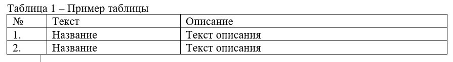
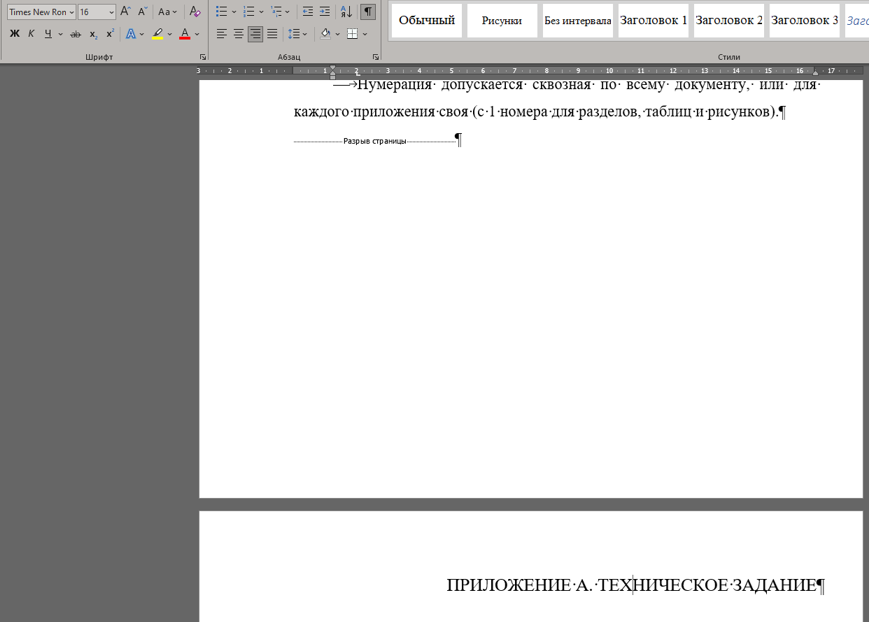

# **ТРЕБОВАНИЕ К ОФОРМЛЕНИЮ**

## **1. Оформление по ГОСТ**
### **1.1. Что такое ГОСТ?**

ГОСТ (Государственный стандарт) — это набор правил, технических требований, методов испытаний и других стандартов, регламентирующих процессы, продукцию и услуги в России.

ГОСТы разрабатываются и утверждаются государственными органами и служат для обеспечения:

* качества,
* безопасности,
* эффективности различных продуктов и процессов.

ГОСТы применяются в промышленности, строительстве, ИТ, медицине и других сферах.

### **1.2. Причина использования ГОСТа**

Использование ГОСТов в документации необходимо для:

1. **Обеспечения качества** — стандарты помогают улучшать процессы и продукцию.
2. **Обеспечения безопасности** — важны для технической и медицинской документации.
3. **Унификации и стандартизации** — упрощают взаимодействие между участниками процесса.
4. **Соблюдения законодательства** — обязательны в ряде сфер (строительство, медицина и др.).

### **1.3. ГОСТы, используемые при работе с ИС в РФ**

В области информационных систем применяются ГОСТы по информационной безопасности, обработке данных и техническим характеристикам ПО.

| № | Название             | Ссылка                                                                           |
| - | -------------------- | -------------------------------------------------------------------------------- |
| 1 | ГОСТ Р 34 АСУ        | [https://www.swrit.ru/gost-34.html](https://www.swrit.ru/gost-34.html)           |
| 2 | ГОСТ Р ИСО/МЭК 27001 | [https://www.swrit.ru/gost-iso-mek.html](https://www.swrit.ru/gost-iso-mek.html) |

---

## **2. ПРИМЕР ОФОРМЛЕНИЯ**

### **2.1. Оформление текста по 34 ГОСТу**

#### **2.1.1. Оформление титульного листа**

* Выполняется по шаблону университета.
* Не нумеруется.

#### **2.1.2. Оформление текста**

При работе с информационными системами используется **34 ГОСТ АСУ**, а требования к структуре документа идут по:

* **ГОСТ 19.201** — Техническое задание. Требования к содержанию и оформлению.
* Нормативные ссылки: ГОСТ 19.106–78 и ГОСТ 2.301–68 (утратил силу).

### **2.2. Оформление полей**
#### **2.2.1. Требования для настройки в отчете**

* Формат страницы: **А4**.
* Ориентация: **Книжная**.

#### **2.2.2. Что такое поля листа**

**Поля листа** — это отступы от краёв страницы:

* левое,
* правое,
* верхнее,
* нижнее.

Они задают рабочую область текста и обязательны для корректного оформления печатных документов.

#### **2.2.3. Cтандартные поля по ГОСТ (чаще всего используемые)**
 
Для учебных и отчётных документов (СПО, ВУЗ):

| Поле    | Размер    |
| ------- | --------- |
| Левое   | **30 мм** |
| Правое  | **20 мм** |
| Верхнее | **20 мм** |
| Нижнее  | **20 мм** |

> Левое поле шире — для подшивки.

#### **2.2.4. Как установить поля листа (поово)**

#####  1. Открыть настройки полей

1. Откройте документ Word
2. Перейдите на вкладку **Макет** (или **Разметка страницы**)
3. Нажмите **Поля**
4. Выберите **Настраиваемые поля…**

/// caption
Рисунок 1 – Настройка полей
///   

#####  2. Задать значения

В открывшемся окне введите:

* **Верхнее:** 2 см
* **Нижнее:** 2 см
* **Левое:** 3 см
* **Правое:** 2 см

/// caption
Рисунок 2 – Параметры страницы
///   

Проверьте:

* Ориентация: **Книжная**
* Применить: **ко всему документу**

Нажмите **ОК**.

#####  3. Проверка корректности

После установки:

* текст не заходит за границы листа;
* номера страниц находятся внутри нижнего поля;
* при печати текст не обрезается.

---
 
### **2.3. Оформление текста**

#### **2.3.1. Требования для настройки в отчете**

* Шрифт: **Times New Roman**
* Цвет: **чёрный**
* Названия в содержании — строчные (кроме аббревиатур).
* Текст разбивается на **разделы, подразделы, пункты, подпункты**.

#### **2.3.2. Пример деления текста:**

* **Раздел** — 1-й уровень (номер + заголовок)
* **Подраздел** — часть раздела
* **Пункт** — часть раздела/подраздела
* **Подпункт** — часть пункта
* **Абзац** — логически выделенная часть текста

Дополнительно:

* допускается текст между заголовками,
* не рекомендуется ссылки на элементы перечисления,
* каждый структурный элемент начинается с абзацного отступа.

---

### **2.4. Оформление аннотации (только при наличии)**

#### **2.4.1. Требования для настройки в отчете**
* Размещается на отдельной пронумерованной странице, является заголовком.
* Текст: **АННОТАЦИЯ**.
* Не нумеруется как раздел.
* Кратко описывает назначение документа.

/// caption
Рисунок 3 — Пример оформления аннотации
///   

---

### **2.5. Оформление содержания (только при наличии)**

#### **2.5.1. Требования для настройки в отчете**
* Размещается после аннотации или титульного листа, в зависимости от вида документа.
* Текст: **СОДЕРЖАНИЕ**.
* Шрифт: **Times New Roman**
* Размер: **16 pt**
* Регистр: **Заглавные буквы**
* Выравнивание: **по центру**
* Интервал: **1,5**
* Цвет: **чёрный**
* Входит в общую нумерацию документа.

/// caption
Рисунок 4 — Пример оформления содержания
///   

#### **2.5.2. Что такое содержание документа**

**Содержание (оглавление)** — это автоматически формируемый список разделов документа с указанием номеров страниц.
Оно создаётся **на основе заголовков**, а не вручную.

Ключевой принцип:

> **Нет правильно оформленных заголовков → нет корректного содержания.**

#### **2.5.3. Подготовка документа (обязательный этап)**

#####  1. Применить стили заголовков

1. Выделите название раздела (например: `ВВЕДЕНИЕ`)
2. Перейдите на вкладку **Главная**
3. В группе **Стили** выберите:

   * **Заголовок 1** — для глав
   * **Заголовок 2** — для параграфов
   * **Заголовок 3** — для подпунктов

Пример структуры:

* Заголовок 1 — `1 Анализ предметной области`
* Заголовок 2 — `1.1 Описание компании`
* Заголовок 3 — `1.1.1 Организационная структура`

❗ **Недопустимо:** делать заголовки жирным шрифтом вручную без стилей.

/// caption
Рисунок 5 — Пример оформления оглавления
///   

#####  2. Вставить автоматическое содержание

1. Установите курсор **в место, где должно быть содержание**
   (обычно после титульного листа)
2. Перейдите на вкладку **Ссылки**
3. Нажмите **Оглавление**
4. Выберите:

   * **Автоматическое оглавление 1**
     или
   * **Автоматическое оглавление 2**

Word автоматически сформирует содержание с номерами страниц.

#####  3. Настройка содержания (рекомендуется)

1. Вкладка **Ссылки → Оглавление**
2. Выберите **Настраиваемое оглавление**

Рекомендуемые параметры:

* Показать уровни: **2–3**
* Заполнитель: **точки**
* Выравнивание номеров страниц: **по правому краю**

Нажмите **ОК**.

#####  4. Обновление содержания (ОБЯЗАТЕЛЬНО)

После любых изменений в тексте:

1. Щёлкните **по содержанию**
2. Нажмите **Обновить поле**
3. Выберите:

   * **Обновить целиком** — если менялись заголовки
   * **Обновить только номера страниц** — если менялся объём текста

---

### **2.6. Оформление заголовков**

#### **2.6.1. Требования для настройки в отчете**

##### **2.6.1.1. Заголовок 1 уровня**

* Шрифт: **Times New Roman**
* Размер: **16 pt**
* Регистр: **Заглавные буквы**
* Выравнивание: **по центру**
* Интервал: **1,5**
* Цвет: **чёрный**

/// caption
Рисунок 6 — Пример оформления заголовка 1 уровня
/// 

##### **2.6.1.2. Заголовок 2 уровня**

* Шрифт: **Times New Roman**
* Размер: **14 pt**
* Регистр: **Как с предложениях**
* Выравнивание: **по ширине**
* Интервал: **1,5**
* Цвет: **чёрный**

/// caption
Рисунок 7 — Пример оформления заголовка 2 уровня
/// 

##### **2.6.1.3. Заголовок 3 уровня**

* Шрифт: **Times New Roman**
* Размер: **14 pt**
* Регистр: **Как с предложениях**
* Выравнивание: **по ширине**
* Интервал: **1,5**
* Цвет: **чёрный**

/// caption
Рисунок 8 — Пример оформления заголовка 3 уровня
/// 

#### **2.6.2. Инструкция: настройка стилей заголовков в Microsoft Word**

##### **2.6.2.1. Зачем настраивать стили заголовков**

Стили заголовков нужны для того, чтобы:

* автоматически формировалось **содержание**;
* сохранялось **единое оформление** документа;
* корректно работала **навигация**;
* документ соответствовал требованиям преподавателя и ГОСТ.

❗ Заголовки, оформленные вручную (жирный, размер), **не считаются стилями**.

##### **2.6.2.2. Где находятся стили заголовков**

1. Откройте документ Word
2. Вкладка **Главная**
3. Группа **Стили**
4. Используются:

   * **Заголовок 1** — главы
   * **Заголовок 2** — подразделы
   * **Заголовок 3** — подпункты

##### **2.6.2.3. Настройка стиля**

###### 1. Открыть изменение стиля

1. В панели **Стили** нажмите правой кнопкой на **Заголовок 1**
2. Выберите **Изменить…**

###### 2. Задать шрифт и выравнивание

Рекомендуемые параметры описаны выше. 

##### **2.6.2.4. Важная настройка: «Обновлять автоматически» — НЕ включать**

В окне **Изменить стиль**:

❌ **Не ставьте галочку** «Обновлять автоматически»

Причина:

* стиль будет меняться при любом ручном изменении текста.

##### **2.6.2.5. Применение стиля к тексту**

1. Выделите заголовок
2. Нажмите нужный стиль:

   * Заголовок 1
   * Заголовок 2
   * Заголовок 3

Word применит все настройки автоматически.

##### **2.6.2.6. Проверка правильности**

Откройте:

* **Вид → Область навигации**

Если заголовки отображаются в структуре — стили настроены корректно.
 

---

### **2.7. Оформление текста абзацев**

#### **2.7.1. Требования для настройки в отчете**

* Шрифт: **Times New Roman**
* Размер: **14 pt**
* Регистр: **Как с предложениях**
* Выравнивание: **по ширине**
* Интервал: **1,5**
* Выравнивание: **по ширине**
* Отступ абзаца: **1,25 см**
* Цвет: **чёрный**

/// caption
Рисунок 9 — Оформление абзацев
///  

Дополнительно:

* Текст должен быть чётким и однозначным.
* Термины должны соответствовать ГОСТам и научной литературе.
* Допускаются сокращения по ГОСТ 2.316–68.

---

### **2.8. Оформление списков**

#### **2.8.1. Требования для настройки в отчете**

* Шрифт: **Times New Roman**
* Размер: **14 pt**
* Выравнивание: **по ширине**
* Интервал: **1,5**
* Выравнивание: **по ширине**
* Отступ абзаца: **1,25 см**
* Цвет: **чёрный**
* Маркер: **числы со скобкой, дефис**
* Каждое перечисление заканчивается **точкой с запятой**, последнее — **точкой**

Внутренние списки:

* Нумерация: **1), 2), 3)**
* Допускаются **дефисы**

/// caption
Рисунок 10 — Оформление списков
/// 

### **2.8.2. Инструкция: как включить линейку и работать с ней в Microsoft Word**

#### **2.8.2.1. Назначение линейки**

**Линейка** в Word используется для:

* установки **отступов абзаца**;
* задания **красной строки**;
* выравнивания текста;
* управления табуляцией;
* контроля границ рабочей области текста.

Линейка напрямую связана с **абзацным форматированием**, а не с полями страницы.

#### **2.8.2.2. Как включить линейку**

##### Способ 1. Через вкладку «Вид» (основной)

1. Откройте документ Word
2. Перейдите на вкладку **Вид**
3. В группе **Показать** установите галочку **Линейка**

После этого появятся:

* **горизонтальная линейка** (над текстом),
* **вертикальная линейка** (слева от страницы, если включена).

##### Если вертикальная линейка не отображается

1. Файл → **Параметры**
2. **Дополнительно**
3. Раздел **Отображение**
4. Установите галочку **Показывать вертикальную линейку в режиме разметки**
5. ОК

#### **2.8.2.3. Элементы линейки и их назначение**

/// caption
Рисунок 11 — Пример линейки
/// 

/// caption
Рисунок 11 — Ползунки линейки
/// 

/// caption
Рисунок 12 — Включить линейку
/// 

На горизонтальной линейке находятся **три маркера**:

| Маркер              | Назначение                                |
| ------------------- | ----------------------------------------- |
| Верхний треугольник | Отступ **первой строки** (красная строка) |
| Нижний треугольник  | Отступ **всего абзаца слева**             |
| Прямоугольник       | Одновременное перемещение обоих отступов  |

#### **2.8.2.4. Как задать красную строку**

##### Стандарт по ГОСТ

* **Отступ первой строки:** 1,25 см

##### Действия

1. Выделите абзац (или весь текст — `Ctrl + A`)
2. На линейке перетащите **верхний треугольник** вправо до 1,25 см

Текст автоматически получит корректную красную строку.

#### **2.8.2.5. Как изменить левый и правый отступы абзаца**

##### Левый отступ

* Перетащите **нижний треугольник** вправо или влево

##### Правый отступ

* Перетащите **правый маркер** (треугольник справа на линейке)

Используется для:

* цитат,
* списков,
* пояснительных блоков.

#### **2.8.2.6. Управление табуляцией**

##### Переключатель табуляции (слева от линейки)

Позволяет выбрать тип табуляции:

* левая
* правая
* по центру
* по десятичной точке

##### Установка табуляции

1. Выберите тип табуляции
2. Щёлкните по линейке в нужном месте
3. Нажмите `Tab` в тексте

❗ Табуляция — **правильная альтернатива пробелам**.

---

### **2.9. Оформление рисунков**

#### **2.9.1. Требования для настройки в отчете**

* Шрифт: **Times New Roman**
* Размер: **12 pt**
* Выравнивание: **по центру**
* Интервал: **1,0**
* Цвет: **чёрный**

#### Особенности:

* Иллюстрации нумеруются по всему документу.
* В приложениях — своя нумерация.
* Ссылки: *рис.12*, *(рис. 12)*, *рисунок 12*.
* Подпись рисунка: под картинкой 

/// caption
Рисунок 13 — Оформление рисунков
///  

### **2.10. Оформление таблиц**

#### **2.10.1. Требования для настройки в отчете**

* Шрифт: **Times New Roman**
* Размер: **12 pt**
* Выравнивание: **по центру**
* Интервал: **1,0**
* Цвет: **чёрный**

Особенности:

* Таблица должна иметь заголовок.
* Заголовок пишут строчными буквами (кроме аббревиатур).
* Требования ГОСТ 1.5–2001.
* При переносе таблицы — шапка повторяется.

Пример:

/// caption
Рисунок 14 — Оформление таблиц
///  

#### **2.10.2.  Инструкция: как создать таблицу в Microsoft Word**

##### **2.10.2.1. Назначение таблиц**

Таблицы используются для:

* структурирования информации;
* представления данных в наглядной форме;
* оформления требований, результатов, характеристик;
* подготовки отчётов и методических материалов.

##### **2.10.2.2. Способы создания таблицы**

**Способ 1. Быстрое создание (рекомендуется)**

1. Установите курсор в место, где должна быть таблица
2. Перейдите на вкладку **Вставка**
3. Нажмите **Таблица**
4. Выделите нужное количество столбцов и строк
5. Щёлкните левой кнопкой мыши

Таблица будет вставлена в документ.

**Способ 2. Через диалог «Вставить таблицу» (точный)**

1. **Вставка → Таблица**
2. Выберите **Вставить таблицу…**
3. Укажите:

   * число столбцов;
   * число строк;
   * ширину столбцов (по умолчанию — автоматически)
4. Нажмите **ОК**

Используется, если требуется строгий контроль параметров.

**Способ 3. Рисование таблицы (для сложной структуры)**

1. **Вставка → Таблица → Нарисовать таблицу**
2. Карандашом нарисуйте внешнюю рамку
3. Разделите её на строки и столбцы

Применяется редко, в основном для нестандартных макетов.

##### **2.10.2.3. Добавление и удаление строк и столбцов**

**Добавить строку или столбец**

1. Установите курсор в таблицу
2. Вкладка **Макет** (Работа с таблицами)
3. Выберите:

   * **Вставить сверху / снизу**
   * **Вставить слева / справа**
**Удалить строку, столбец или таблицу**

1. Выделите нужный элемент
2. **Макет → Удалить**
3. Выберите вариант удаления

##### **2.10.2.4. Объединение и разделение ячеек**

**Объединить ячейки**

1. Выделите нужные ячейки
2. **Макет → Объединить ячейки**

Используется для заголовков таблиц.

**Разделить ячейку**

1. Выделите ячейку
2. **Макет → Разделить ячейки**
3. Укажите количество строк и столбцов

---

### **2.11. Оформление списка литературы**

#### **2.11.1. Требования для настройки в отчете**

* Шрифт: **Times New Roman**
* Размер: **14 pt**
* Выравнивание: **по ширине**
* Интервал: **1,5**
* Выравнивание: **по ширине**
* Отступ абзаца: **1,25 см**
* Цвет: **чёрный**
* Маркер: **числы со скобкой, дефис**

#### **2.11.2. Сборники:**

Сиротинина О.Б. Структурно-функциональные изменения… // Русская словесность… ВолГУ, 2007.

#### **2.11.3. Законодательные акты:**
Гражданский Кодекс РФ... // Российская газета. – 12.01.2016.

#### **2.11.4. Ссылки на сайт:**

ГОСТ ЕСКД // Профессиональная разработка технической документации
URL: [https://www.swrit.ru/gost-eskd.html](https://www.swrit.ru/gost-eskd.html) (дата обращения: 12.12.2024)

---

### **2.12. Оформление приложений**

* Шрифт: **Times New Roman**
* Размер: **16 pt**
* Выравнивание: **по правому краю**
* Интервал: **1,5**
* Цвет: **чёрный**
* Регистр: **Прописными буквами**
* Нумерация допускается: **А, Б, В…** или **1, 2, 3…**
* Каждое приложение — с новой страницы
* Нумерация внутри приложения — сквозная, индивидуальная для каждого приложения

/// caption
Рисунок 15 – Пример настроек для приложения
///  

 